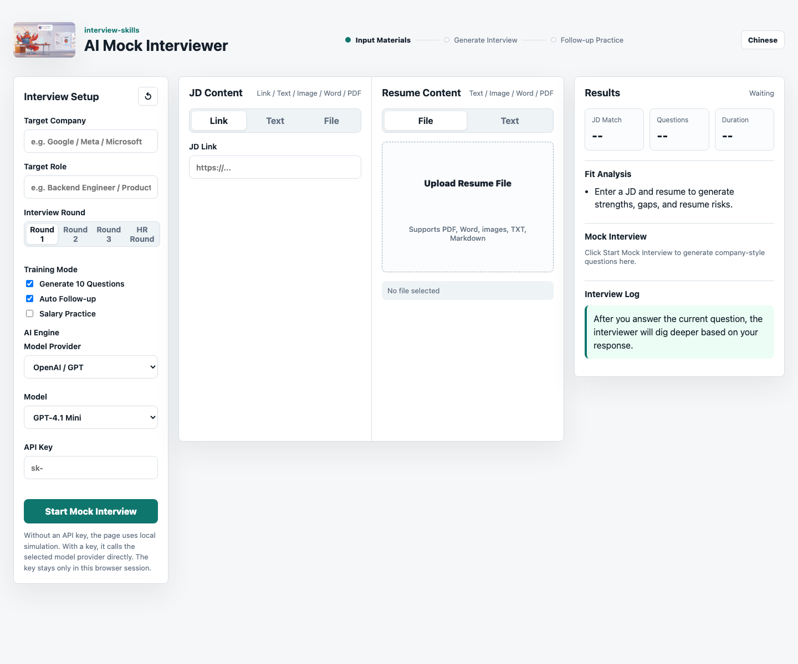

# Big Tech AI Mock Interviewer Skill

Generate targeted mock interview questions from a real job description and a candidate resume. This skill simulates company-specific interview styles across technical rounds, behavioral rounds, HR interviews, salary negotiation, and full multi-round interview loops.

## News

- **2026-06-04**: Added a browser-based Mock Interview UI and enable users to mock interview process with provied JD and resume.
- **2026-06-01**: Added `install-skill.sh`, allowing terminal users to run `bash install-skill.sh https://github.com/jennifer88huang/interview-skills.git` from the repository root.
- **2026-05-28**: Added global big tech interview support for Google, Meta, Amazon/AWS, Microsoft, and related scenarios. 
- **2026-04-24**: Added HR interview drills, salary negotiation scripts, and full multi-round interview flow simulation. 
- **2026-04-06**: Added the initial Skill, PRD, JD parsing, resume parsing, company profiles, question design, and BEI/STAR behavioral interview framework. 

## What It Does

- Parses the target JD into hard skills, soft skills, and hidden evaluation signals.
- Parses the resume to identify strengths, project evidence, risks, and likely follow-up areas.
- Compares JD requirements against the resume and highlights strong matches, gaps, and weak spots.
- Generates 10 tailored interview questions with difficulty, evaluation points, answer hints, and follow-up directions.
- Supports interactive follow-up: answer a question, then ask the AI interviewer to dig deeper.
- Provides good-answer vs bad-answer comparisons for selected questions.
- Supports HR interview drills, salary negotiation scripts, and full multi-round interview simulations.

## Supported Companies

| China Big Tech | Global Big Tech | Other Tech Companies |
| --- | --- | --- |
| Alibaba, Ant Group, Cainiao, Alibaba Cloud | Google | Didi, Kuaishou, Xiaohongshu |
| Tencent, WeChat, Tencent Games, Tencent Cloud | Meta | Pinduoduo, JD.com, NetEase |
| ByteDance, Douyin, TikTok, Feishu | Amazon, AWS, Ads, Retail | Huolala, Trip.com, Beike |
| Baidu, Meituan, Huawei | Microsoft, Azure, Office, Teams | More coming soon |

Companies not listed are also supported. The skill will infer the interview style from the JD, role, team, and candidate background.

## Role Coverage

- Engineering: backend, frontend, mobile, AI/ML, data engineering, architecture, SRE, security
- Product: consumer product, B2B product, growth product, game product
- Business: operations, marketing, business analysis
- Corporate functions: data analyst, HR, legal, finance

## Quick Start

### Browser UI

You can use the mock interview page directly without installing the Skill:

```text
https://jennifer88huang.github.io/interview-skills/ui/?lang=en
```

The browser UI supports a full interactive practice loop:

1. Fill in the target company, target role, and interview round on the left panel.
2. Enter the JD in the center panel by pasting a link, text, or uploading a PDF, Word, TXT, or Markdown file.
3. Provide your resume in the center panel. You can upload your resume file or paste resume content manually. 
4. In the lower-left AI Engine section, choose a model provider and model, and paste your API key.   
   When you provide a key, the simulation process goes with live questions and follow-ups. If you do not provide API key, the page uses local simulation.
6. Click **Start Mock Interview** in the lower-left section, answer the question in the **Result** panel in the right. Click **Generate Follow-up** or **Next Question** based on your requirement. 

The top progress indicator moves through Input Materials, Generate Interview, and Follow-up Practice. Use the top-right language button to switch between English and Chinese.



Install from OpenClaw:

```text
/skill install git:jennifer88huang/interview-skills@main
```

For terminal-based OpenClaw, install manually. The current `openclaw skills` command supports `list`, `info`, and `check`; it does not provide an `install` subcommand.

```bash
# Run from this repository root.
bash install-skill.sh https://github.com/jennifer88huang/interview-skills.git
```

Equivalent manual install:

```bash
mkdir -p ~/.openclaw/skills
git clone https://github.com/jennifer88huang/interview-skills.git ~/.openclaw/skills/interview-skills
openclaw skills info interview-skills
openclaw skills list
```

To update an existing local install:

```bash
git -C ~/.openclaw/skills/interview-skills pull --ff-only
```

Then start with one sentence:

```text
I am interviewing for a Google L4 backend engineer role. Please run a mock interview based on this JD and my resume.
```

```text
I am preparing for an Amazon SDE II / AWS backend interview. Simulate the full interview loop.
```

```text
Help me prepare for a ByteDance backend engineer interview. The JD focuses on distributed systems, MySQL, Redis, and Go.
```

## Typical Workflow

```text
1. Tell the AI your target company and role.
        ↓
2. Paste the JD. Partial JDs are acceptable.
        ↓
3. Paste or upload your resume.
        ↓
4. Receive a JD-vs-resume match analysis.
        ↓
5. Receive 10 tailored interview questions.
        ↓
6. Review preparation advice ranked by urgency.
        ↓
7. Optionally enter follow-up mode, HR mode, salary negotiation mode, or full-loop mode.
```

## Output Format

Each full mock interview includes:

- Interview report header: company, role, interviewer identity
- Company style analysis
- JD vs resume match analysis
- 10 tailored questions with difficulty, evaluation points, answer hints, and follow-up directions
- Preparation advice with urgent/reference priority
- Next-step commands for follow-up practice

## Global Big Tech Interview Support

### Google

Focuses on coding clarity, edge cases, complexity analysis, system design abstraction, reliability trade-offs, collaboration, and Googliness.

### Meta

Focuses on coding speed, large-scale product systems, impact, ownership, metrics, conflict handling, and execution in high-intensity environments.

### Amazon

Focuses on coding, system design, customer impact, operational reliability, cost, and Leadership Principles such as Customer Obsession, Ownership, Dive Deep, Bias for Action, and Deliver Results.

### Microsoft

Focuses on coding quality, design maintainability, cloud and platform fundamentals, collaboration, growth mindset, and team fit.

## Example Prompts

```text
I am interviewing for Google L4 backend engineer. The JD requires distributed systems and Java. Here is my resume.
```

```text
I am interviewing for Meta E5 infrastructure engineer. Help me prepare coding, system design, and behavioral rounds.
```

```text
I am interviewing for Amazon SDE II on AWS. Generate Leadership Principles questions based on my projects.
```

```text
I have an upcoming Microsoft Azure backend interview. Simulate the full interview loop from phone screen to hiring manager.
```

```text
Give me a good answer vs bad answer comparison for Q3.
```

```text
Only practice HR questions: resignation reason, salary expectation, and career plan.
```

## Repository Structure

```text
interview-skills/
├── SKILL.md
├── README.md
├── README-en.md
├── PRD.md
├── assets/
└── references/
    ├── company-profiles.md
    ├── question-design.md
    ├── jd-parser.md
    ├── resume-parser.md
    └── bei-framework.md
```

## Notes

This skill provides interview preparation guidance and answer directions, not guaranteed interview predictions or official company interview content. Always validate technical answers against your real project experience and the latest role requirements.
