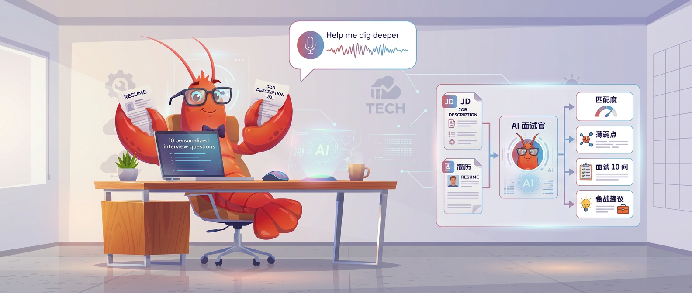

<div align="center">

# Interview Skills — AI Mock Interview Coach

[](https://github.com/jennifer88huang/interview-skills/stargazers)
[](https://github.com/jennifer88huang/interview-skills/network/members)
[](https://github.com/jennifer88huang/interview-skills/commits/main)
[](LICENSE)
[]()

**The open-source AI mock interview tool that personalizes every question to your resume and the exact job description you are applying for.**

Interview Skills is an AI-powered mock interview coach for software engineers, product managers, data scientists, and career switchers preparing for technical interviews, behavioral interviews, system design interviews, coding interviews, HR interviews, and salary negotiation at FAANG companies, Big Tech firms, and China's top internet companies. It reads your actual JD and resume — not a generic question bank — and generates a tailored interview simulation that reflects the target company's real interview style.

**Live Demo:** [Interview Skills AI Mock Interview Coach](https://jennifer88huang.github.io/interview-skills/)  
**Web App:** [Start a mock interview from JD and resume](https://jennifer88huang.github.io/interview-skills/ui/?lang=en)



[News](#news) · [Who Is This For](#who-is-this-for) · [Quick Start](#quick-start) · [What It Does](#what-it-does) · [Key Scenarios](#key-scenarios) · [Supported Companies](#supported-companies) · [Example Prompts](#example-prompts) · [FAQ](#faq) · [Repository Structure](#repository-structure)

</div>

---

## News

- **2026-06-04**: Added a browser-based Mock Interview UI where users can enter a JD and resume, generate a personalized interview simulation, answer questions, and practice follow-up questions online.
- **2026-06-01**: Added `install-skill.sh`, one-command install for terminal users.
- **2026-05-28**: Added global big tech interview support for Google, Meta, Amazon/AWS, Microsoft, and related scenarios.
- **2026-04-24**: Added HR interview drills, salary negotiation scripts, and full multi-round interview flow simulation.
- **2026-04-06**: Initial release — JD parsing, resume parsing, company profiles, question design, BEI/STAR behavioral interview framework.

---

## Who Is This For

Interview Skills is designed for anyone preparing for a competitive job interview:

- **Software engineers** targeting Google, Meta, Amazon, Microsoft, ByteDance, or any Big Tech company who need to practice coding, system design, and behavioral rounds together
- **Product managers** who need company-specific behavioral and case-study questions aligned to the JD and their own project history
- **New graduates and students** without much work experience who want realistic questions calibrated to entry-level expectations
- **Career switchers** moving across industries or roles who need to bridge the gap between their current resume and the target JD
- **Experienced engineers** preparing for senior or staff-level interviews that require deeper system design and leadership signal
- **International job seekers** preparing for cross-cultural interviews at both China's top internet companies and global Big Tech

If you have a job description and a resume, Interview Skills will tell you exactly where your gaps are and what the interviewer is most likely to ask.

---

## What It Does

- Parses the target job description into hard skills, soft skills, and hidden evaluation signals
- Parses the resume to identify strengths, project evidence, risks, weak spots, and likely follow-up areas
- Compares JD requirements against the resume and highlights strong matches, gaps, and weak spots
- Generates 10 tailored mock interview questions with difficulty ratings, evaluation points, answer hints, and follow-up directions
- Supports interactive follow-up: answer a question, then ask the AI interviewer to dig deeper
- Provides good-answer vs bad-answer comparisons for any question
- Supports coding interview practice, system design interview practice, behavioral interview practice (STAR framework), HR interview drills, salary negotiation scripts, and full multi-round interview simulations

---

## Key Scenarios

| Scenario | What You Get |
|----------|-------------|
| **FAANG technical interview** | Coding + system design + behavioral questions calibrated to L4/L5/E5 expectations, company-specific style |
| **China Big Tech interview** | Company culture and value alignment questions (Alibaba, ByteDance, Tencent style), algorithm deep-dives, project probing |
| **HR interview prep** | Questions on resignation reasons, salary expectations, career plans — with hidden evaluation signals explained |
| **Salary negotiation simulation** | Scripts for anchoring, responding to lowball offers, and handling competing-offer scenarios |
| **Full multi-round loop** | Linked simulation from phone screen through final round, showing how answers in Round 1 affect Round 2 |
| **Resume gap analysis** | Side-by-side JD vs resume match, identifying exactly what the interviewer will likely challenge |
| **Good vs bad answer comparison** | For any question, see a high-score example, a low-score example, and a point-by-point breakdown |
| **Entry-level / new grad** | Questions scaled to internship experience, academic projects, and potential rather than years of work |

---

## Supported Companies

| China Big Tech | Global Big Tech | Other Tech |
|---------------|----------------|------------|
| Alibaba, Ant Group, Cainiao, Alibaba Cloud | Google | Didi, Kuaishou, Xiaohongshu |
| Tencent, WeChat, Tencent Games, Tencent Cloud | Meta | Pinduoduo, JD.com, NetEase |
| ByteDance, Douyin, TikTok, Feishu | Amazon, AWS | Huolala, Trip.com, Beike |
| Baidu, Meituan, Huawei | Microsoft, Azure, Office, Teams | More coming soon |

Companies not listed are also supported. The skill infers the interview style from the JD, role, team, and candidate background.

---

## Role Coverage

- **Engineering:** backend, frontend, mobile (iOS/Android), AI/ML, data engineering, architecture, SRE, security
- **Product:** consumer product, B2B product, growth product, game product
- **Business:** operations, marketing, business analysis
- **Corporate functions:** data analyst, HR, legal, finance

---

## Quick Start

### Option 1: Browser UI (no install needed)

Open the web app directly — no API key required for the basic simulation:

```
https://jennifer88huang.github.io/interview-skills/ui/?lang=en
```

1. Enter your target company, role, and interview round
2. Paste or upload the JD (PDF, Word, text, or Markdown)
3. Paste or upload your resume
4. Click **Start Mock Interview**


### Option 2: OpenClaw Skill (chat interface)

```text
/skill install git:jennifer88huang/interview-skills@main
```

Then start in one sentence:

```text
I am interviewing for a Google L4 backend engineer role. Here is my JD and resume. Please run a mock interview.
```

### Option 3: Terminal manual install

```bash
bash install-skill.sh https://github.com/jennifer88huang/interview-skills.git
```

Or manually:

```bash
mkdir -p ~/.openclaw/skills
git clone https://github.com/jennifer88huang/interview-skills.git ~/.openclaw/skills/interview-skills
```

---

## Typical Workflow

```
1. Provide target company + role
        ↓
2. Paste the JD (partial JDs are fine)
        ↓
3. Paste or upload your resume
        ↓
4. Receive JD-vs-resume match analysis
   (strong match / needs work / resume weak spots)
        ↓
5. Receive 10 tailored interview questions
   (difficulty / evaluation points / answer hints / follow-up directions)
        ↓
6. Review preparation advice ranked by urgency
        ↓
7. Enter follow-up mode, HR mode, salary negotiation, or full-loop simulation
```

---

## Global Big Tech Interview Support

### Google
Focuses on coding clarity, edge cases, time/space complexity, system design abstraction, reliability trade-offs, cross-functional collaboration, and Googliness.

### Meta
Focuses on coding speed, large-scale distributed systems, measurable impact, product intuition, ownership, metrics, conflict handling, and execution in fast-moving environments.

### Amazon
Focuses on coding correctness, operational reliability, customer impact, cost awareness, and 16 Leadership Principles including Customer Obsession, Ownership, Dive Deep, Bias for Action, and Deliver Results.

### Microsoft
Focuses on code quality, maintainability, cloud and platform fundamentals, growth mindset, inclusive collaboration, and long-term team fit.

---

## Example Prompts

```text
I am interviewing for Google L4 backend engineer. The JD requires distributed systems and Java. Here is my resume.
```

```text
I am interviewing for Meta E5 infrastructure engineer. Help me prepare coding, system design, and behavioral rounds.
```

```text
I am interviewing for Amazon SDE II on AWS. Generate Leadership Principles questions based on my projects.
```

```text
I have an upcoming Microsoft Azure backend interview. Simulate the full loop from phone screen to hiring manager.
```

```text
Give me a good answer vs bad answer comparison for Q3.
```

```text
Only practice HR questions: resignation reason, salary expectation, and career plan.
```

```text
I have an offer but the total compensation is below my target. Help me prepare a salary negotiation script.
```

---

## FAQ

### What is an AI mock interview?

An AI mock interview is a simulation of a real job interview conducted by an AI system. It generates tailored interview questions based on a specific job description and the candidate's resume, then allows the candidate to practice answering with AI follow-up probing. Unlike generic question banks, AI mock interviews adapt to the candidate's background and the target company's interview style.

### How does Interview Skills differ from LeetCode, Glassdoor, or other prep tools?

Most interview prep tools offer static, generic question banks that are not specific to your background or the role you are applying for. Interview Skills reads your actual resume and the exact JD you are targeting, identifies the gap between your experience and the role requirements, and generates questions that reflect what an interviewer at that specific company would most likely ask. It also explains the hidden evaluation signal behind each question.

### Which companies are supported for mock interviews?

Interview Skills supports mock interviews for Google, Meta, Amazon, AWS, Microsoft, ByteDance (TikTok, Douyin, Feishu), Alibaba (Ant Group, Alibaba Cloud), Tencent (WeChat, Tencent Games), Baidu, Meituan, Huawei, Didi, Kuaishou, Xiaohongshu, Pinduoduo, JD.com, NetEase, and 30+ other companies. For companies not explicitly listed, the skill infers the interview style from the JD, role, and team context.

### What interview types are supported?

Supported interview types include: coding interviews, technical deep-dive interviews, system design interviews, behavioral interviews using the STAR framework, BEI (Behavioral Event Interview) format, HR interviews, salary negotiation simulations, and full multi-round interview loops from phone screen through final round and hiring manager round.

### Do I need a resume and JD to use it?

No. You can provide only the target company and role name, and the skill generates questions based on typical patterns for that company and role. However, providing both a JD and a resume significantly improves personalization — the skill can then highlight which parts of your background are strong matches, which are gaps, and which the interviewer is most likely to challenge.

### Is Interview Skills free to use?

Yes. Interview Skills is fully open-source under the MIT license and free to use. The browser UI at [jennifer88huang.github.io/interview-skills/ui/](https://jennifer88huang.github.io/interview-skills/ui/) requires no account. The OpenClaw Skill version runs inside the OpenClaw AI assistant.

### What is the STAR method in behavioral interviews?

The STAR method (Situation, Task, Action, Result) is a structured framework for answering behavioral interview questions. Each answer should describe the context (Situation), your specific responsibility (Task), what you personally did (Action), and the measurable outcome (Result). Interview Skills uses the STAR framework to evaluate answers and identify which components are missing or too vague.

### What are Amazon Leadership Principles in interviews?

Amazon Leadership Principles (LPs) are 16 core values — including Customer Obsession, Ownership, Dive Deep, Bias for Action, and Deliver Results — that Amazon uses as the evaluation framework for all behavioral interview questions. Amazon interviews typically require candidates to demonstrate each principle through specific past experiences. Interview Skills generates LP-aligned behavioral questions and helps candidates prepare structured STAR-format answers for each principle.

### Can I simulate a full multi-round interview loop?

Yes. You can ask for a complete simulation from Round 1 through final round and HR round, with each round's questions linked to the previous round. The simulation shows how answers in early rounds influence what interviewers probe in later rounds, and identifies which round is most likely to be the elimination point based on your background.

### How do I get the best results?

Provide four inputs in one message: target company, target role, the full JD, and your resume. Then specify what you want to practice (e.g., technical only, full loop, HR only, salary negotiation). The more context you provide, the more the questions will reflect your actual interview situation.

---

## Repository Structure

```
interview-skills/
├── SKILL.md                 # Main skill entry point and full instruction set
├── README.md                # Chinese README
├── README-en.md             # English README (this file)
├── PRD.md                   # Product requirements document
├── assets/                  # Screenshots and banner images
└── references/
    ├── company-profiles.md  # Interview style, process, and evaluation criteria by company
    ├── question-design.md   # Question design principles and role-specific frameworks
    ├── jd-parser.md         # JD parsing strategy and hidden signal extraction
    ├── resume-parser.md     # Resume parsing strategy and weakness identification
    └── bei-framework.md     # BEI/STAR framework and company value question bank
```

---

## Contributing

Contributions are welcome. If you want to add a new company profile, improve question templates, fix documentation, or add a new role category, please open an issue or submit a pull request. See [CONTRIBUTING.md](CONTRIBUTING.md) for guidelines.

If you find this project useful, consider giving it a ⭐ — it helps more job seekers discover it.

---

## Notes

This skill provides interview preparation guidance and answer directions, not guaranteed interview predictions or official company interview content. Always validate technical answers against your real project experience and the latest role requirements.
